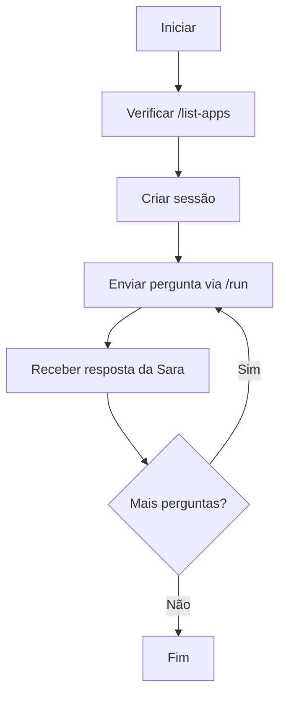

# 💬 Como Conversar com a Sara

## 🚀 Opções para Interagir com Sara

### 1. 🖥️ **Localmente (Desenvolvimento)**

```bash
# Subir a API ADK
cd /home/alex/Alex/adk
adk api_server

# Em outro terminal, usar o cliente Python
python sara_client_example.py --interactive
```

### 2. ☁️ **EasyPanel (Produção)**

```bash
# Após deploy no EasyPanel
python sara_client_example.py https://seu-dominio.easypanel.host --interactive
```

### 3. 🌐 **cURL (Testes rápidos)**

```bash
# 1. Verificar se API está funcionando
curl https://seu-dominio.com/list-apps

# 2. Criar sessão
curl -X POST https://seu-dominio.com/apps/sara-medical-law-agent/users/test123/sessions \
  -H "Content-Type: application/json" \
  -d '{"state": {}}'

# 3. Enviar mensagem (use o sessionId retornado acima)
curl -X POST https://seu-dominio.com/run \
  -H "Content-Type: application/json" \
  -d '{
    "appName": "sara-medical-law-agent",
    "userId": "test123",
    "sessionId": "COLE_SESSION_ID_AQUI",
    "newMessage": {"parts": [{"text": "Quais são os direitos dos pacientes?"}]}
  }'
```

## 📱 Exemplos Práticos

### Cliente Python Completo (sara_client_example.py)

**Executar demonstração automática:**
```bash
python sara_client_example.py
```

**Modo conversa interativa:**
```bash
python sara_client_example.py --interactive
```

**Conectar com EasyPanel:**
```bash
python sara_client_example.py https://seu-dominio.easypanel.host --interactive
```

### Exemplos de Perguntas para Sara

✅ **Perguntas que Sara responde:**
- "Quais são os direitos básicos dos pacientes?"
- "O que diz a lei sobre prontuário médico?"
- "Como funciona o sigilo médico?"
- "Quais são as regras da telemedicina?"
- "O que fazer em caso de erro médico?"
- "Como funciona o consentimento informado?"
- "Quais são as responsabilidades do CFM?"

❌ **Perguntas que Sara NÃO responde:**
- "Como está o tempo hoje?"
- "Qual é a capital do Brasil?"
- "Como fazer um bolo?"
- (Sara só responde sobre direito médico e da saúde)

## 🔧 Estrutura da API ADK

### Endpoints Principais:

1. **`GET /list-apps`** - Lista agentes disponíveis
   ```json
   ["sara-medical-law-agent"]
   ```

2. **`POST /apps/{agent}/users/{user}/sessions`** - Cria sessão
   ```json
   {"sessionId": "abc123..."}
   ```

3. **`POST /run`** - Executa conversa
   ```json
   {
     "appName": "sara-medical-law-agent",
     "userId": "seu-user-id",
     "sessionId": "session-id-aqui",
     "newMessage": {"parts": [{"text": "sua pergunta aqui"}]}
   }
   ```

4. **`GET /docs`** - Documentação OpenAPI completa

## 🏥 Fluxo de Conversa



## 🛠️ Integração em Aplicações

### JavaScript/Node.js
```javascript
const axios = require('axios');

class SaraClient {
  constructor(baseUrl) {
    this.baseUrl = baseUrl;
    this.sessionId = null;
  }
  
  async createSession(userId) {
    const response = await axios.post(
      `${this.baseUrl}/apps/sara-medical-law-agent/users/${userId}/sessions`,
      {state: {}}
    );
    this.sessionId = response.data.sessionId;
    return this.sessionId;
  }
  
  async sendMessage(userId, message) {
    const response = await axios.post(`${this.baseUrl}/run`, {
      appName: 'sara-medical-law-agent',
      userId: userId,
      sessionId: this.sessionId,
      newMessage: {parts: [{text: message}]}
    });
    return response.data.newMessage.parts[0].text;
  }
}
```

### PHP
```php
class SaraClient {
    private $baseUrl;
    private $sessionId;
    
    public function __construct($baseUrl) {
        $this->baseUrl = rtrim($baseUrl, '/');
    }
    
    public function createSession($userId) {
        $url = "{$this->baseUrl}/apps/sara-medical-law-agent/users/{$userId}/sessions";
        $response = $this->post($url, ['state' => []]);
        $this->sessionId = $response['sessionId'];
        return $this->sessionId;
    }
    
    public function sendMessage($userId, $message) {
        $payload = [
            'appName' => 'sara-medical-law-agent',
            'userId' => $userId,
            'sessionId' => $this->sessionId,
            'newMessage' => ['parts' => [['text' => $message]]]
        ];
        $response = $this->post("{$this->baseUrl}/run", $payload);
        return $response['newMessage']['parts'][0]['text'];
    }
}
```

## 🎯 Casos de Uso

1. **Sistema de Suporte Médico** - Integrar Sara em sistema hospitalar
2. **Chatbot para Site Médico** - Responder dúvidas de pacientes
3. **App de Consulta Jurídica** - Especializada em direito médico
4. **Sistema de Treinamento** - Para profissionais da saúde
5. **Portal de Informações** - Sobre direitos e deveres médicos

## 🚨 Importante

- **GOOGLE_API_KEY** deve estar configurada
- Sara só responde sobre direito médico e da saúde
- Cada usuário pode ter múltiplas sessões
- Sessões mantêm contexto da conversa
- API segue padrão OpenAPI para fácil integração

**🎉 Agora você está pronto para conversar com a Sara!** 